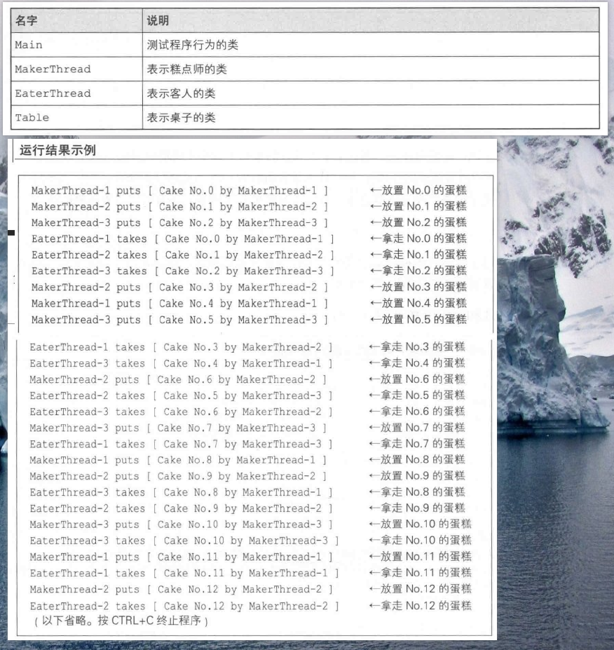

# Producer-Consumer模式: 我来做,你来用

采用该模式, 生成数据的线程与使用数据的线程在并发运行时不会相互抢占。多个线程能够协调运行。

## 解读

在生产者-消费者模式中加入一个“桥梁角色”，用于处理生产和消费之间处理速度的差异。

### 说明

- 这个模式在我们日常生活中可谓非常常见。例如买早餐豆浆举例，通常会有一位师傅在后面灌豆浆，有一个人负责卖豆浆，
  客人每隔几分钟来一波，为了保证及时响应顾客，需要提前准备好一些豆浆以便急客带走， 当生意闲下来的时候再往货柜上
  补满豆浆。因为灌豆浆的速度比不上的购买豆浆的速度，故我们先准备一批以应付高峰，待闲时在补充储备。

- 线程亦是如此，准备好一批线程在内存中等待，当需要时使用，并且不停地补充，待闲时有补充到一定数量的线程以待消费。

## 关联

## 介绍

### xx模式模式

### 例子-sample-01

### 角色元素

### 拓展使用

### 生存性

### 可复用性

### JDK: java.util.concurrent包和Producer-Consumer模式

