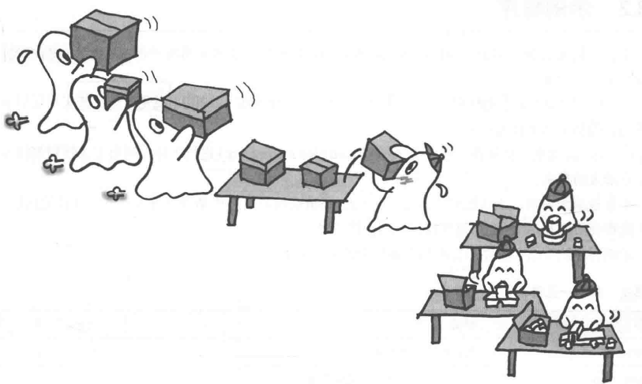
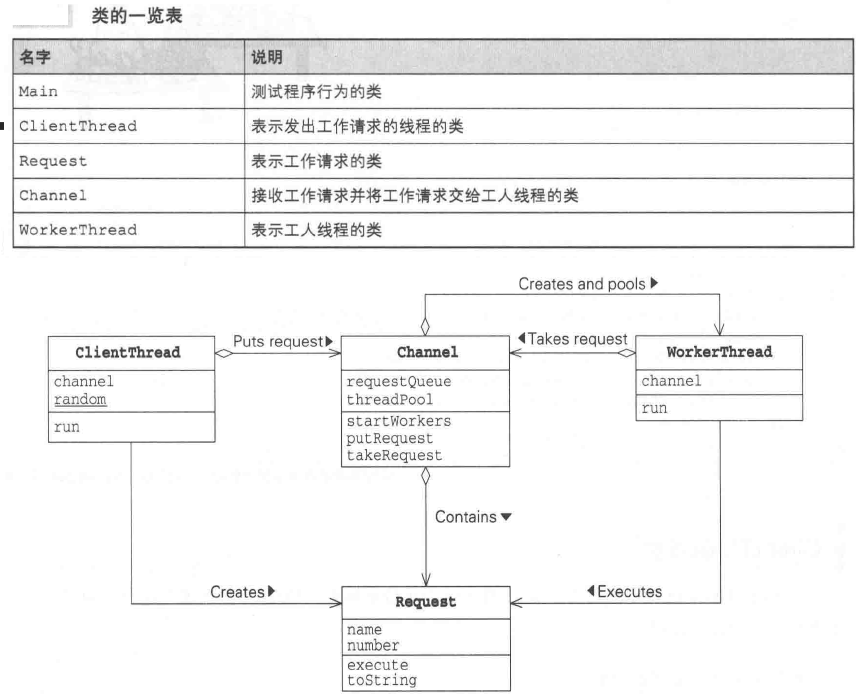
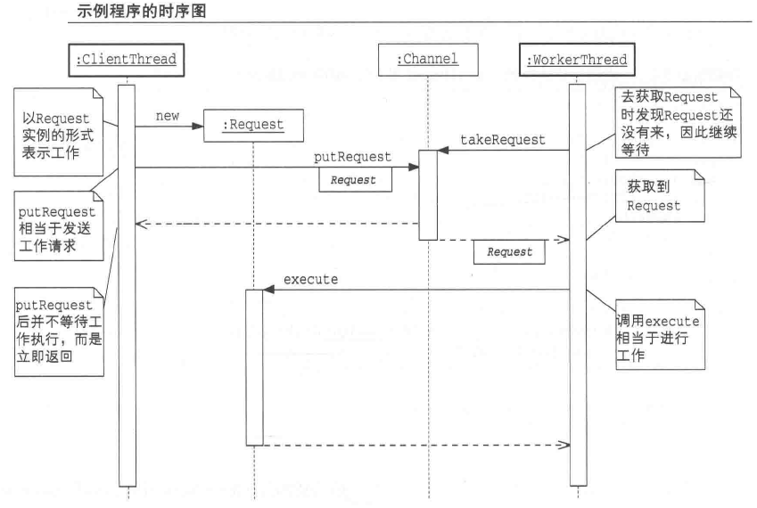
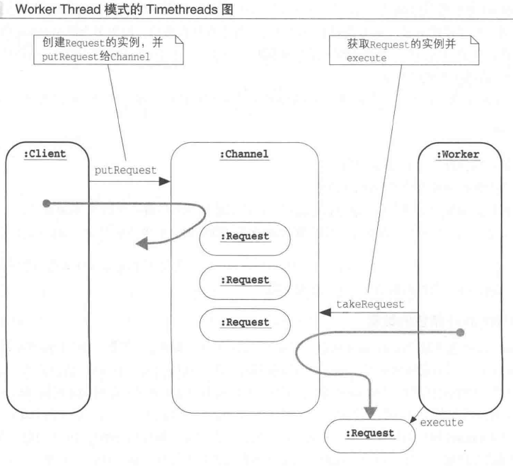

# Worker Thread模式: 工作没来就一直等,工作来了就干活

多个线程通过线程池进行等待,然后按照顺序接受工作并执行。

该模式减少创建线程时的资源消耗，还可以通过调节等待线程的个数来控制可用的资源量。

## 解读

与生产者-消费者有点类似，但也有不同的地方。虽然都是准备好一批东西，但是生产-消费模式是消耗掉,不可复用。而该模式可以复用。

### 说明

- 假设北京的胡同里面有很多的车夫，假设有100个，这时候来了50个客人，他们马上就可以享受到服务，而另外50个会闲置继续等待客人的到来。
  也许有一天，客人并发的数量超过100，那么拉车公司可能会考虑雇佣更多的车夫。

- 线程池的意义也在如此，但是足够多的线程会撑爆JVM，所以当你需要使用线程池的时候，请了解你的环境是怎么的。

## 关联

## 介绍

### xx模式模式

### 例子

### 角色元素

### 拓展使用

### 生存性

### 可复用性

### JDK