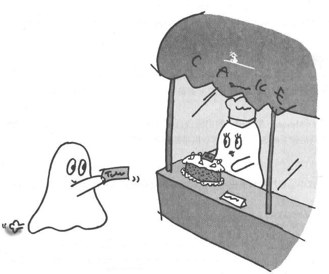
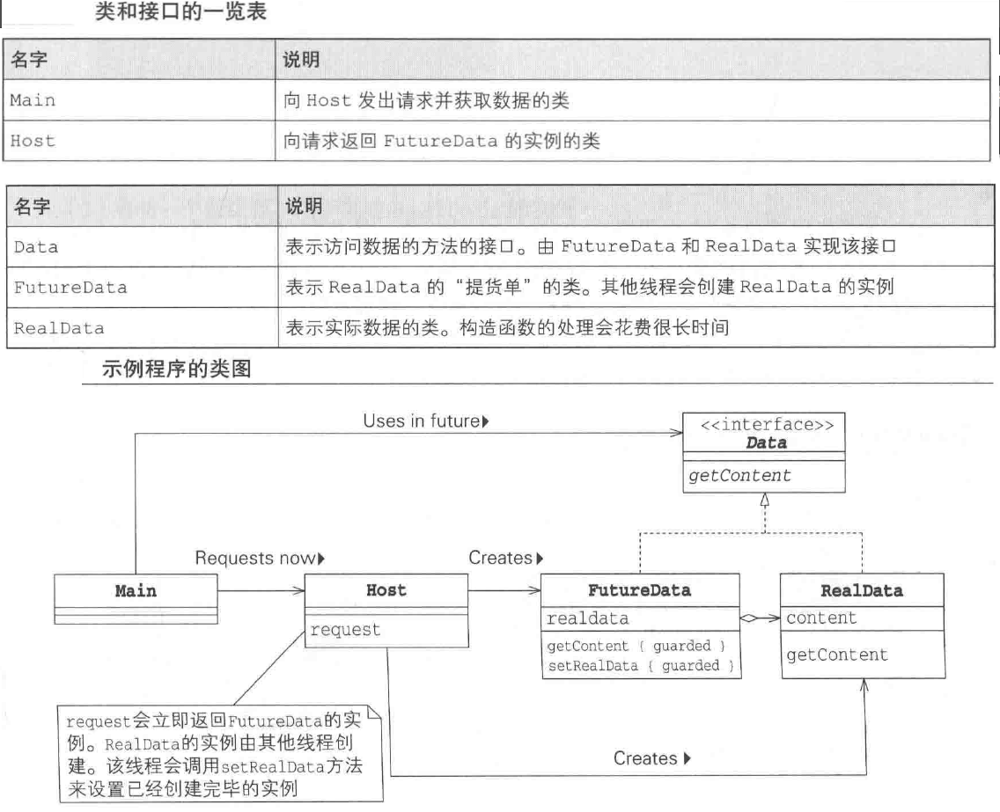

# Future模式: 先给您提货单

该模式下,可以同步获取交给其他线程的结果。 该模式适用于调用异步方法的情况。

## 解读

未来模式与任务委托模式类似，但不同的是，这个明确了主线程的参与，同时目的也不同，是委托别人去完成。重点不在于此，而在于我们不需要等待他人完成才进行下一步。

### 说明

- 倘若我们需要买一个蛋糕，你会到了蛋糕店才傻傻等待蛋糕做出来吗？
- 这时候，收银员给你一张票据，告诉你在未来的一段时间内，随时可以过来提取（约定好了时间，除非你希望哪个蛋糕一直放在他们的冰箱里）。这时候，
  你便可以离开蛋糕店，去买一些红酒以及牛排，准备好今日的生日晚餐，待到黄昏时分，蛋糕也做完了，你带着票据去开开心心把蛋糕提走，过了一个愉快的夜晚。
  -在面对一些IO密集型等待时间较长的操作的时候，我们可以先让别人去做，我们等到合适的时机再去取即可，不需要等待它完成才能进行下一步操作。

### 例子

### 角色元素

- Client(请求者)
  Client角色向Host角色发出请求(request),并会立即接收到请求的处理结果(放回值),VirtualData角色. 不过,
  这里接收到的VirtualData角色实际上是Future角色. 也就是说,Futere角色戴上了VirtualData角色的面具.
  Client角色没有必要知道返回值究竟是 RealData角色还是Fututre角色. 稍后,Client角色会通过VirtualData角色来进行操作.
- Host Host角色会创建新的线程,并开始在新线程中创建RealData角色,同时,它会将Future角色(当作VirtualData角色)
  放回给Client角色. 新线程在创建了RealData角色后, 会将其设置到Future角色中. -VirtualData(虚拟数据)
  VirtualData角色是让Future角色与RealData角色具有一致性的角色
- RealData(真实数据)
  ReadData角色是表示真实数据的角色. 创建该对象需要花费很多时间.
- Future(期货)
  Future角色是REaldData角色的"提货单",由Host角色传递给Client角色. 从程序行为上看,对Client角色而言,
  Future角色就是VirtualData角色.

### 拓展使用

### 生存性

### 可复用性

### JDK